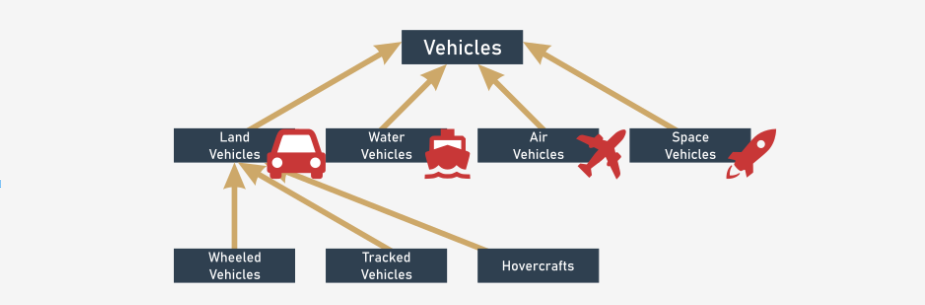
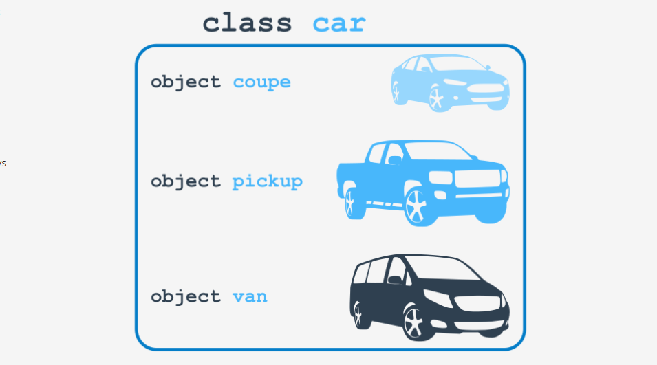
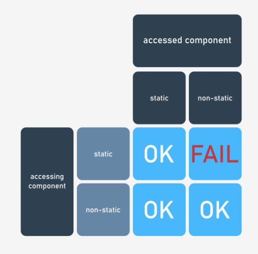

# Contenido
* [Conceptos básicos de la programación orientada a objetos](#conceptos-básicos-de-la-programación-orientada-a-objetos)
* [Pilas: una mirada desde dos perspectivas diferente](#pilas-una-mirada-desde-dos-perspectivas-diferentes)
* [Componentes de clase](#componentes-de-clase)
* [Componentes estáticos](#componentes-estáticos)
* [Objetos y punteros](#objetos-y-punteros)
# Conceptos básicos de la programación orientada a objetos
El lenguaje C++ fue creado como una herramienta universal para la programación orientada a objetos. Esto no significa que no podamos usarlo para otra metodología de programación. 

## Clases y objetos
En el enfoque de programación por procedimientos se pueden distinguir dos mundos diferentes: el mundo de los **datos** y el mundo del **código**. El mundo de los datos está poblado por variables de diferentes tipos, mientras que el mundo del código está habitado por código agrupado en funciones.

El enfoque orientado a objetos sugiere una forma diferente de pensar. Los datos y el código están juntos en el mismo mundo, divididos en clases. Cada clase es como un recipiente que puede ser usado cuando buscamos crear un objeto útil. Cada objeto tiene un conjunto de rasgos, llamados **propiedades** y un conjunto de actividades llamados **métodos**.

El "recipiente" puede ser modificado si no es adecuado para ciertos propósitos, en efecto, nuevas clases pueden ser creadas. Las nuevas clases **heredan** propiedades y métodos de los originales y usalmente añaden nuevos, creando nuevas y más específicas herramientas.

## Clases - ¿Qué son?
Para nuestros propósitos `clase` se refiere a una "categoría" o "género". Por ejemplo hablemos de *vehículos*. Todos los vehículos están relacionados por una caracteristica importante: la habilidad de moverse. La clase "vehículo" es una clase muy amplia por lo que necesitamos definir algunas clases más especificas. Las clases más específicas son llamadas, o serán llamadas, **subclases**. La clase vehículo es la **superclase** de las subclases. La jerarquía de clases crece desde arriba hacia abajo, como las raíces de un árbol. La clase más general y amplia está siempre arriba (super) mientras que sus descendientes abajo (subs).

Hay muchas clasificaciones para subclases de vehículo, por ejemplo:
* Vehiculos terrestres
* Vehiculos acuáticos
* Vehiculos aéreos
* Vehiculos espaciales



Las direcciones de las flechas siempre apuntan a la superclase. La clase superior es una expecion, no tiene una superclase.

## Objetos - ¿Qué son?
Un objeto es un ser perteneciente a una clase. Es una encarnación de los requetimientos, rasgos y cualidades asignados a una clase. Teniendo en cuenta la jerarquía de clases, un objeto perteneciente a una clase pertenece a todas las superclases de la misma.

Por ejemplo: un vehiculo particular pertenece a la clase "vehiculos con ruedas". Este ademas pertenece a todas las superclases de su clase principal, es decir, es un miembor de la clase "vehiculos" tambien.



## Herencia
Cualquier objeto encuadernado a un nivel específico de una jerarquía de clases hereda todos sus rasgos (así como requerimientos y cualidades) definides en todas las superclases. La clase madre del objeto define nuevos rasgos que serán heradados por sus subclases.

## ¿Qué tiene cualquier objeto?
La programacion orientada a objetos asume que cada objeto existente debe ser equipado con tres diferentes grupos de atributos:
1. **Nombre**: el nombre identifica a un objeto único cno su namespace propio (aunque pueden existir objetos anónimos tambien).
2. **Propiedades**: el conjunto de propiedades lo hacen original, único y diferente (existe la posibilidad de que existan objetos sin propiedades).
3. **Actividades**: un objeto tiene un conjunto de habilidades para realizar actividades específicas que pueden cambiar al mismo objeto o a otros objetos.

Una idea que puede ayudar a identificar estos 3 atributos es pensar que cuando describimos un objeto usamos:
* Un **sustantivo** para definir el **nombre** del objeto.
* Un **adjetivo** para definir las **propiedades** del objeto.
* Un **verbo** para definir las **actividades** del objeto.

Por ejemplo - *"Mas es un gato grande que duerme todo el día"*:
```
Object name = Max
Home class = Cat
Property = Size (large)
Activity = Sleep (all day)
```


## ¿Qué es todo esto?
La programación de objetos es el arte de definir y expandir clases. Las clases son modelos de una parte muy especifica de la realidad que refleja propiedades y actividades encontradas en la vida real. Las clases definidas al principio usualmente son muy generales e imprecisas para cubrir la gran cantidad de casos reales. Por lo tanto, las clases se pueden extender y modificar para crear nuevas clases más específicas y precisas, mediante la herencia. Las nuevas clases pueden añadir nuevas propiedades y actividades y ser más útiles en aplicaciones específicas.

La creacion de las clases no tiene nada que ver con la creación de objetos: **la existencia de una clase no significa que cualquier objeto compatible será automáticamente creado**. La clase en sí no es capaz de crear un objeto - debemos crearlo nosotros. Pero el lenguaje C++ nos permite hacer esto.

Es momento de observar como definir la clase más simple y cómo crear un objeto. Veamos un ejemplo:


```cpp
class OurClass {};
```


Hemos definido una clase. Esta lcase es bastante pobre, no tiene propiedades ni actividades. Esto no importa por ahora. Cuanto más simple la clase mejor para nuestro propósito.

La definición de la clase comienza con la palabra reservada `class` seguida de un **identificador** que nombra a la clase. Luego añadimios un par de llaves cuyo contenido interior define las propiedades y actividades de la clase.

En este caso nuestra clase está vacía. 

La nueva clase definida se convierte en un equivalente a un **type** y podemos usarla como un nombre de type. Si queremos crear un objeto de nuestra clase `OurClass` declaramos la variable donde almacenaremos los objetos de esta clase y crearemos un objeeto al mismo tiempo:


```cpp
OurClass object;
```


# Pilas: una mirada desde dos perspectivas diferentes
Una pila o *stack* es una estructura desarrollada para almacenar datos de una forma muy especifica. Imaginemos una pila como una pila de monedas, podemos ir apilandolas una a una, pero para obtener una moneda debemos sacar la de la ubicación superior, no podemos quitar la de la base. Si deseamos hacer esto último debemos sacar una a una todas las monedas.

El nombre alternativo de una fila es **LIFO**, el cual es una abreviación de la descripción del comportamiento de las pilas: *"Last In - First Out"* (Primero en entrar, ultimo en salir).

Una pila es un objeto de dos operaciones elementales convencionales llamadas *"push"* (cuando un nuevo elemento es ubicado en la cima) y *"pop"* (cuando un elemento existente es tomado desde la cima).

## Pilas o LIFO
Primero debemos decidir como almacenar valores que lleguen a nuestra pila. Se sugiere usar el método más simple con un vector para este trabajo. Asumiremos de forma imprudente que no hay más de 100 valores en la pila al mismo tiempo. Además supondremos que el elemento del indice 0 es la base de la pila.

La pila en si es declarada aquí:


```cpp
int stack[100];
```


## Puntero a pila
El arreglo no es suficiente para implementar una pila. Necesitamos algunos detalles adicionales. Por ejemplo, necesitamos una variable que sea la responsable de almacenar un numero de elementos almacenados actualmente en la pila. Esta variable es generalmente llamada *"stack pointer"* o puntero a pila, abreviado **SP**.

Inicialmente, la pila está vacía, por lo que al SP se le deberá asignar un valor de 0.


```cpp
int SP = 0;
```


## Push
Estamos listos para definir una función que ubique un valor en la pila. Esto es lo que supondremos:
* El nombre de la función será `push`.
* La función obtiene un argumento del tipo `int`.
* La función no retorna nada.
* La función coloca el valor del argumento en el primer elemento libre en el vector e incrementa el SP.

Así es como lo haremos:


```cpp
void push(int value) {
    stack[SP++] = value;
}
```


## Pop
Es momento de crear la función para tomar un valor de la pila. Así es como la imaginamos:
* El nombre de la función es `pop`.
* La función no tiene ningún argumento.
* La función lee el valor de la cima de la pila y decrementa el SP-
* La función retorna el valor tomado de la pila.

La función resulta:


```cpp
int pop() {
    return stack[--SP];
}
```

> [Código de ejemplo de pilas](ejemplos/InitialStacks.cpp)

## Pros y contras
Nuestra pila está lista. Por supuesto tiene algunas falencias y la implementación puede ser mejorada de muchas formas, pero la idea general está bien y podemos usar nuestra pila si la necesitamos.

Pero ...

Mientras más la usemos, más **desventajas** descubriremos. Veamos algunas de ellas:
* Dos variables esenciales (`stack` y `SP`) son completamente vulnerables; cualquiera puede modificarlas de formas incontrolables, destruyendo el efecto de la pila, esto no significa que sea malicioso, por el contrario, esto podría suceder como resultado de un descuido; imagina que por error escribimos algo como: 


```cpp
    SP = 100;
```


    El funcionamiento de la pila sería completamente desorganizado.
* Podría suceder que un día necesitemos más de una pila; deberemos entonces crear otro vector para el almacenamiento de la pila, otro SP para el nmuevo vecto y probablemente más funciones `push()` y `pop()`.
* Podría además suceder que no solo necesitemos funciones `push()` y `pop()` sino algunas otras cosas; podemos implementarlas pero intenta imaginar que sucede cuando tenemos docenas de pilas implementadas por separado.
* Hemos usado el `int` para la pila, pero podríamos querer usar otras pilas definidas para otros tipos: floats, strings o incluso arrays y estructuras.

El enfoque objetivo provee soluciones para cada uno de estos problemas. Nombremos cada uno primero.

* La habilidad para ocultar (proteger) valores seleccionados contra accesos no autorizados es llamado **encapsulación**; los valores encapsulados no pueden ser accedidos ni modificados si deseamos usarlos de forma exclusiva.
* Cuando tenemos una clase implementando todos los comportamientos necesitamos, podemos producir tantas pilas como deseemos; no necesitamos copiar o replicar ninguna parte de código.
* La habilidad de enriquecer una pila con nuevas funciones proviene de la **herencia**; podemos crear una nueva clase (o más precisamente una **subclase**) que herede todos los rasgos existentes desde la superclase añadiendo algunas nuevas.
* Podemos crear una **plantilla** que es una clase generalizada y parametrizada, lista para materializarla en muchas diferentes encarnaciones; su código puede adaptarse para requerimientos variados y, por ejemplo, crear pilas listas para trabajar con otros tipos de datos.

Escribiremos una nueva implementación de una pila desde cero. Usaremos el enfoque objetivo, guiandonos paso por paso en el mundo de la programación de objetos.

## Pilas desde cero
Usaremos un vector como almacen de la pila y un `int` como SP. Solo debemos colocar ambos en una clase:


```cpp
class Stack {
    int stackStore[100];
    int sp;
}
```


Buscamos encapsular ambas variable y hacerlas inaccesibles desde fuera de la clase. Este tipo de data es llamado **privado** en programación de objetos. Es privada porque solo la clase misma puede accederlas y modificarlas.

Si deseamos marcar alguna parte de los datos de la clase como privados, debemos añadir la keyword `private` antes de la declaración.


```cpp
class Stack {
    private:
        int stackStore[100];
        int sp;
};
```


Realmente no necesitamos usar la keyword `private` en este punto ya que se asigna por defecto cuando no hay otra opción implicitamente especificada. Sin embargo, es preferible ser estricto de todos modos.

## La pila en acción
Ahora es momento de las dos funciones que implementen las operaciones `push` y `pop`. El lenguaje C++ asume que una funcion de este tipo (siendo una actividad de clase) puede describirse en dos formas diferentes:
* **Dentro de la clase**, cuando el cuerpo de la clase contiene una implementación completa del método.
* **Fuera de la clase**, cuando el cuerpo contiene solo el header de la función; el cuerpo de la función es ubicado fuera de la clase.

Es una decisión propia cuál elegir. Veremos ambos y decidiremos implementar la función `pop()` dentro del cuerpo de la clase, mientras que implementaremos la función `push()` fuera de la clase.

Buscamos invocar estas funciones por lo que serán accesibles para usuarios de la clase (en contraste con las variables declaradas que son ocultas del usuario ordinario de la clase). Este tipo de componente es llamado `public` y usaremos esta keyword para enfatizar este hecho.

La declaración final resuta:


```cpp
class Stack {
    private:
        int stackStore[100];
        int sp;
    public:
        void push(int value);
        int pop() {
            return stackstore[--sp];
        }
};

void Stack::push(int value) {
    stackStore[sp++] = value;
}
```


La función que implementa las actividades de la clase y es ubicada fuera del cuerpo de la clase necesita ser descripta en una forma muy específica. Sus nombres deben ser **clasificados** usando el nombre de la clase y el operador `::`.

Nuestra clase no está lista para ser usada aún. Observar que el valor de `sp` no está inicializado. Debemos añadir otra función a nuestra clase, la cual será invocada implicitamente cada vez que una nueva pila sea creada. Llamamos a esta clase **constructor** porque es la responsable de la construcción apropiada de cada nuevo objeto de la clase.

Desafortunadamente no podemos nombrar esta función de la forma que queramos. Su nombre es determinado por los requerimientos del lenguaje C++. Debe ser nombrada igual que la clase.

Hay otro punto importante: **los constructores no son funciones reales**. Estos no retornan ningun type, ni siquiera `void`. Debemos tomar esto en consideración cuando declaramos o definimos un nuevo constructor.

La clase está completa en el siguiente snippet:


```cpp
class Stack {
    private:
        int stackStore[100];
        int sp;
    public:
        Stack() {
            sp = 0;
        }

        void push(int value);
        int pop() {
            return stackStore[--sp];
        }
};

void Stack::push(int value) {
    stackStore[sp++] = value;
}
```


> [Código de ejemplo de pilas con POO](ejemplos/POOStacks.cpp)

Ahora haremos algo más. buscamos una nueva clase que no solo manipule pilas sino que también sea capaz de evaluar una suma de todos los elementos actualmente almacenados en la pila.

Además no deseamos modificar la pila definida anteriormente, en otras palabras, buscamos consturir una **subclase** de la clase `Stack`.

Así es como se verá:


```cpp
class AddingStack : Stack {
};
```

La clase no define ningún nuevo componente aún, pero esto no significa que está vacío. **Esto deriva todos los componentes definidos por su superclase** - el nombre de la superclase es escrito directamente luego de los dos puntos, siguientes al nombre de la nueva clase.

Cualquier objeto de la clase `AddingStack` puede hacer todo lo que los objetos de la clase `Stack` hacen.

Ahora vamos a añadirle algunos nuevos trucos:
1. Buscamos que la función `push` no solo pushee el valor en la pila, sino que tambien agregue el valor de la varaible `sum`.
2. Buscamos que la función `pop` no solo saque valores de la pila, sino que substraiga el valor de la variable `sum`.

Primero añadimos una nueva variable a la clase. Está será privada, como las varaibles previas.

Luego cambiaremos la funcionalidad de las funciones sin cambiar su nombre. Podemos decir más precisamente que la interface de la clase sigue siendo la misma cuando cambiamos la implementación al mismo tiempo.


```cpp
class AddingStack : Stack {
    private:
        int sum;
    public:
        void push(int value);
        int pop();
};
```


Comenzaremos con la implementación de la función `push()`. Esto es lo que esperamos de ella:
* Que añada el valor a la variable `sum`.
* Que pushee el valor a la pila.

Esta es la nueva función `push`:


```cpp
void AddingStack::push(int value) {
    sum += value;
    Stack::push(value);
}
```


La primer sentencia es clara y no requiere explicación, pero al ver la segunda linea vemos que **no necesitamos definir la operación** de push nuevamente. La implementación de esta actividad es implementada dentro de la clase `Stack`. Lo unico que debemos hacer es usarla, pero debemos indicar claramente la clase que contiene la función para evitar confusiones con cualquier otra función con el mismo nombre.

Por esto es que colocamos el prefijo `Stack::` en la invocación.

De manera similar, esta es la nueva función `pop`:


```cpp
int AddingStack::pop() {
    int val = Stack::pop();
    sum -= val;
    return val;
}
```


Ahora definimos una nueva función, que llamaremos `get_sum` que retornará el valor de `sum`.


```cpp
int AddingStack::get_sum() {
    return sum;
}
```


Otra cosa que debemos tener en consideración es la inicialización de este valor `sum`. Este debe ser cero cuando el objeto es creado, lo cual hacemos en el constructor. Ya sabemos escribir un constructor, pero hay un punto en el que debemos enfatizar.

Cuando creamos un objeto de la clase `AddingStack` debemos tener en cuenta la inicialización de la superclase también. Veamos el nuevo constructor:


```cpp
AddingStack::AddingStack() : Stack() {
    sum = 0;
}
```


La frase `: Stack()` es una petición a invocar el **constructor de la superclase** antes de que el constructor actual comience su trabajo.

Veamos el código completo de la nueva clase:


```cpp
class AddingStack: Stack {
    private:
        int sum;
    public:
        AddingStack();
        void push(int value);
        int pop();
        int get_sum();
}

AddingStack::AddingStack() : Stack () {
    sum = 0;
}

void AddingStack::push(int value) {
    sum += value;
    Stack::push(value);
}

int AddingStack::pop() {
    int val = Stack::pop();
    sum -= val;
    return val;
}

int AddingStack::get_sum(){
    return sum;
}
```

> [Código de ejemplo subclase de Stack](ejemplos/POOStackSubClass.cpp)

# Componentes de clase
Una clase es un conjunto de variables (también llamadas camps o propiedades) y funciones (llamadas métodos). Ambas, son **componentes** de la clase.

La siguiente clase:


```cpp
class Class {
    int value;
    void set_val(int value);
    int get_val();
}
```
Posee 3 componentes: una variable tipo `int` llamada `value` y dos funciones llamadas `set_value` y `get_value` respectivamente. El nombre de la clase es `Class`.

Como los 3 componentes son declarados sin usar un **especificador de acceso** (`private`/`public`) todos ellos son **privados**.

Esto significa que una clase declarada del siguiente modo:


```cpp
class A {
    type var;
}
```
Puede ser leida como:


```cpp
class A {
private:
    type var;
}
```


## Especificadores de acceso
La clase anterior será reescrita para mostrar el uso de los **especificadores de acceso**.

Los componentes `set_value` y `get_value` son públicos (accesibles para todos los usuarios de la clase), mientras que `value` es privado (solo accesible para la clase):


```cpp
class Class {
private:
    void set_val(int value);
    int get_val();
public:
    int value;
}
```


## Creando un objeto
Supongamos que está en vigor la siguiente declaración:


```cpp
Class the_object;
```


Cualquier objeto de la clase es equipado con todos los componentes definidos en la clase. Esto significa que el objeto `the_object` tiene los mismos 3 componentes que su clase base.

Los componentes públicos están disponibles para su uso. Podemos hacer lo siguiente:


```cpp
the_object.set_val(0);
```


El componente privado está oculto e indefinido. **No** podemos hacer lo siguiente:


```cpp
the_object.value = 0;
```


## Sobreescribiendo nombres de componentes
Podemos colocar la definición de una función declarada en la clase en la misma clase o fuera de ésta.

Una función que es componente de una clase tiene acceso total a otros componentes de clase, incluso a los privados.

Si cualquier función introduce una entidad de nombre idéntico a cualquier componente de clase, el nombre del componente de clase es **sobreescrito**.

La función `set_value` usa un parámetro llamado `value`. El parámetro sobreescribe el componente de clase llamado `value`. Esto significa que la sentencia:


```cpp
value = value;
```
aplica al parámetro `value` y **no hace nada con el componente de clase del mismo nombre**.

## Puntero `this`
Cada objeto es equipado con un componente especial que contiene los siguientes rasgos:
* Su nombre es `this`.
* No debe declararse explícitamente (es una palabra clave), por lo que no puede sobrescribirse.
* Es un puntero al objeto actual - cada objeto tiene su propia copia del puntero `this`.

La regla general dice que:
* Si `S` es una estructura o clase y `S` tiene un componente llamado C y;
* Si `p` es un puntero a una estructura/clase de tipo `S`
* Luego, el componente `C` deberá ser accedido de las siguientes dos formas:
    * `(*p).C` donde `p` es dereferenciado **explicitamente** para acceder al componente `C`.
    * `p -> C` donde `p` es dereferenciado **implicitamente** para acceder al componente `C`.

*Esto significa que el componente sobreescrito tambien puede revelarse usando el siguiente método:*


```cpp
class Class {
public:
    void set_val(int value) 
    { 
        this -> value = value;
    }
    int get_val();
private:
     int value;
};
```


## Calificación de los nombres de los componentes

Si el cuerpo de cualquier función de clase es dado fuera de la misma, su nombre debe ser calificado con el nombre de la clase y el operador `::`.


```cpp
class Class {
public:
  void set_val(int value) 
  { 
    this -> value = value;
  }
  int get_val();
private:
  int value;
};

int Class::get_val() 
{
      return value;
}
```


Los nombres de las funciones pueden ser sobrecargados al igual que funciones ordinarias. Pueden usarse también parámetros por defecto:


```cpp
class Class {
public:
  void set_val(int value) 
  { 
    this -> value = value;  
  }
  void set_val() 
  { 
    value = -2; 
  }
  int get_val() 
  { 
    return value; 
  }
private:
  int value;
};
```


## Constructores
Una función con el mismo nombre que su clase madre es llamado **constructor**. El constructor intenta construir el objeto durante su creación, es decir, inicializa valores, ubica memoria, crea otros objetos, etc. El constructor puede acceder a todos los componentes del objeto, al igual que cualquier otra función de la clase pero **no debes ser invocado directamente**.

Además el constructor **no debe ser declarado usando una especificación de tipo de retorno**, incluyendo void.

La siguiente clase:


```cpp
class Class {
public:
    Class() 
    { 
        this -> value = -1; 
    }
    void set_val(int value) 
    { 
        this -> value = value; 
    }
    int get_val() 
    { 
        return value; 
    }
private:
    int value;
};
```
Es equipada con un constructor que inicializa el valor de `value` en `-1`.

Declarando el objeto de la clase del siguiente modo:


```cpp
Class object;
```
Invocamos implicitamente al constructor.

## Sobrecargando constructores
Los constructores también pueden ser sobrecargados, dependiendo de las necesidades y requerimientos especificos.


```cpp
class Class {
public:
    Class() 
    { 
        this -> value = -1; 
    }
    Class(int val) 
    { 
        this -> value = val; 
    }
    void set_val(int value) 
    { 
        this -> value = value; 
    }
    int get_val() 
    { 
        return value; 
    }
private:
    int value;
};
```
La clase anterior tiene dos constructores diferentes que difieren en su número de parámetros. El segundo requiere un parámetro (el primero ninguno) y setea el campo `value` con el parámetro recibido.

El constructor es seleccionado durante la creación del objeto:


```cpp
Class object1, object2(100);
cout << object1.get_val() << endl;
cout << object2.get_val() << endl;
```


El snippet de código anterior da como resultado:
```

-1
100
```


Si una clase tiene al menos un constructor, uno de estos debe ser usado durante la creación del objeto, es decir, no está permitido escribir una declaración que no especifique un constructor objetivo.

## Copiando constructores
Existe un tipo especial de constructor destinado a copiar un objeto en otro. Los constructores de este tipo tienen **un parámetro** referenciado a un objeto de la misma clase y es usado para copiar todos los datos imporantes de un objeto fuente al objeto nuevamente creado (o más precisamente, al objeto **actualmente creado**).

Se denominan constructores de copia (*copying constructors*) y son implicitamente invocados cuando una declaración de un objeto es seguida de un iniciador. Esto puede además ser invocado si la declaración especifica un constructor adecuado para la misma.

La palabra "Copia" no debe ser tomada literalmente. Los datos del objeto no necesitan ser copiados actualmente. Pueden solo ser manipulados y procesados. Lo que es más importante es que los datos se tomen de un objeto diferente de la misma clase (o similar). Si el constructor de copia no existe dentro de una clase concreta y el iniciador se utiliza realmente durante la declaración de un objeto, su contenido se copiará realmente (en un sentido literal) "campo por campo", como si el objeto hubiera sido clonado.


```cpp
#include <iostream>

using namespace std;

class Class1 {
public:
	Class1(int val) 
	{ 
		this -> value = val; 
	}
	Class1(Class1 const &source) 
	{ 
		value = source.value + 100; 
	}
	int value;
};

class Class2 {
public:
	Class2(int val) 
	{ 
		this -> value = val; 
	}
	int value;
};

int main() 
{
	Class1 object11(100), object12 = object11;
	Class2 object21(200), object22 = object21;

	cout << object12.value << endl;
	cout << object22.value << endl;
}
```


En el codigo anterior, la keyword `const` es una promesa de que la función no intentará modificar los valores almacenados en el objeto dereferenciado.

El código de ejemplo muestra dos clases diferentes. La primera tiene un copying constructor, mientras que la segunda no. Dos objetos son creados para ambas clases mientras que el segundo de los objeto es creado copiando a los primeros.

El programa da como salida:
```
200
200
```


La clase `Class1` construye un nuevo objeto incrementando su valor en 100.

## Fugas de memoria
Los constructores que hemos visto hasta ahora han hecho su trabajo iniciando objetos, pero ninguna de sus acciones ha tenido que ser revertida. En otras palabras, no había nada que limpiar después de que el objeto terminara su vida.

Esto es bastante raro en la programación real. Muchos de los objetos son ubican memoria que necesitan para su operación. Esta memoria podría ser liberada cuando el objeto finaliza su actividad y la mejor forma de hacerlo es realizando una limpieza automática. Una falla en la limpieza causa un fenómeno llamado **Memory leaking** o fuga de memoria, donde la memoria no usada (pero aún ubicada) crece en tamaño afectando el rendimiento del sistema.

Podemos provocar intencionalmente una fuga de memoria con el siguiente código:


```cpp
#include <iostream>

using namespace std;

class Class {
public:
	Class(int val) 
	{ 
		value = new int[val]; 
		cout << "Allocation (" << val << ") done." << endl; 
	}
	int *value;
};

void make_a_leak() 
{
	Class object(1000);
}

int main() 
{
	make_a_leak();
}
```


La clase `Class` tiene solo un constructor, que es responsable de ubicar memoria del tamaño especificado por el valor de su parámetro. El objeto de esta clase es creado como una variable local dentro de la función `make_a_leak()`.

Podemos imaginar que la creación consiste de dos fases:
1. El objeto en si es creado y una parte de la **memoria es implicitamente ubicada** en el objeto.
2. El constructor **explicitamente ubica otra parte de la memoria**.

La variable `object` es un ejemplo de una variable *automática*. Esto significa que la variable automáticamente termina su vida cuando la ejecución de la función que contiene la declaración de las variables termina.

## Destructores
Podemos protegernos contra peligros definiendo una función especial llamada **destructor**. Los destructores tienen las siguientes restricciones:
* Si una clase es llamada `X` su destructor es llamado `~X`.
* Una clase **no puede tener más de un destructor**.
* Un destructor **debe ser una función sin parámetros**
* Un destructor no debe ser invocado explicitamente.

El siguiente ejemplo muestra la clase anterior un poco modificada - **añadimos un destructor a la clase**. El destructor libera memoria ubicada en el campo `value` protegiendonos de fugas de memoria.


```cpp
#include <iostream>

using namespace std;

class Class {
public:
	Class(int val) 
	{ 
		value = new int[val]; 
		cout << "Allocation (" << val << ") done." << endl; 
	}
	~Class() 
	{
		delete [] value;
		cout << "Deletion done." << endl;
	}
	int *value;
};

void make_a_leak() 
{
	Class object(1000);
}

int main() 
{
	make_a_leak();
}
```


El programa en el editor, cuando se compila y ejecuta, muestra las siguientes dos líneas en la pantalla:

```
Allocation (1000) done.
Deletion done.
```


# Componentes estáticos
Todas las variables de nuestro código son de una de las siguientes dos categorias:
* **Variables automáticas**, creadas y destruidas repetida y automáticamente durante la ejecución del programa.
* **Variables estáticas**, de existencia continua durante toda la ejecución del programa.

Por defecto en C++ todas las variables son *automáticas* a menos que sean explicitamente declaradas como estáticas (`static`).

Veamos el siguiente ejemplo:


```cpp
#include <iostream>

using namespace std;

void fun() 
{
	int var = 99;
	cout << "var = " << ++var << endl;
}

int main() 
{
	for(int i = 0; i < 5; i++)
		fun();
}
```


La variable `var` es creada cada vez qyue la función `fun` es invocada y destruída cada vez que la misma completa su ejecución. Podemos decir que su creación y eliminación son *automáticas*.

Esto significa que la función siempre dará la misma salida:
```
var = 100
var = 100
var = 100
var = 100
var = 100
```


Ahora modificamos el código un poco agregando solo la keyword `static` delante del `int` de la firma de la función:


```cpp
#include <iostream>

using namespace std;

void fun() 
{
    static int var = 99;
    cout << "var = " << ++var << endl;
}

int main() 
{
    for(int i = 0; i < 5; i++)
        fun();
}
```


El comportamiento ha cambiado radicalmente. Ahora la variable `var` es creada e iniciada una sola vez durante el llamado *prólogo de programa* y destruida luego de la finalización del programa completo, durante la operación del llamado *epílogo de programa*.

Esto significa que la variable `var` existe incluso cuando la función no está trabajando y en efecto el valor de la variable es preservado entre las subsecuentes invocaciones de la misma. El programa ahora dará la siguiente salida:
```
var = 100
var = 101
var = 102
var = 103
var = 104
```


## Instancias de clase
Cada objeto creado a partir de una clase particular es llamado **instancia de la clase**. Podemos decir que cada instancia es un universo separado y no tiene nada que ver con las demás instancias. Todos los componentes de objeto están encapsulados dentro de la instancia.

El siguiente ejemplo es erróneo y causará error de compilación por dos circunstancias importantes:
* La variable `val` no será creada hasta el momento de la creación de un objeto y habrán tantas como instancias de la clase se creen.
* La función `print()` no puede ser invocada fuera del objeto ya que no sería capaz de acceder a la variable `val` no existente.

## Componentes estáticos de la clase
Todas las reglas anteriores son verdaderas si nos referimos a **componentes no estáticos** de la clase. El lenguaje C++ nos permite definir otros tipos de componentes, los *estáticos*.

Un componente estático existe a través de toda la vida del programa. Además, es siempre solo un componente independientemente del número de instancias de la clase.

Podemos decir que **todas las instancias comparten los mismos componentes estáticos**.

El programa del siguiente ejemplo involucra una clase con dos campos del mismo tipo: uno estático y otro no estático.

La variable `Static` dentro de parte pública de la clase es solo una declaración. Esto significa que la variable tiene que tener explicitamente separadas definición e inicialización, y ambas deben colocarse fuera de la definición de la clase.

Otro razonamiento dice que la definición tiene que ser independiente del body de la clase porque las **variables estáticas actualmente no son parte de ningún objeto**. En nuestro programa hacemos esto con una línea de código entre el body de la clase y la función `main`.


```cpp
#include <iostream>

using namespace std;

class Class {
public:
	static int Static;
	int NonStatic;
	void print()
	{
		cout << "Static = " << ++Static << 
		        ", NonStatic = " << NonStatic << endl;
	}
};

int Class::Static = 0;

int main() 
{
	Class instance1, instance2;

	instance1.NonStatic = 10;
	instance2.NonStatic = 20;
	instance1.print();
	instance2.print();
}
```


El programa da la siguiente salida:
```
Static = 1, NonStatic = 10
Static = 2, NonStatic = 20
```

## Componetnes de clase estáticos
Los rasgos únicos de las variables estáticas de clase las predestinaron a ser usadas como contadores de instancias de una clase particular.

El siguiente archivo es un buen ejemplo de esta implementación: [Contador de instancias](ejemplos/InstanceCounter.cpp)

No solo las variables de clase pueden ser declaradas como estáticas. Las **funciones** tambien pueden serlo.

Las **funciones estáticas** pueden ser invocadas cuando no hay instancias de la clase creadas.

Una clase con una función estática declarada del siguiente modo:

```cpp
static void HowMany() 
```

Permite una llamada a la misma desde otra función (como el `main()`) del siguiente estilo:
```cpp
Class::HowMany();
```

O también usando alguna de las instancias:

```cpp
... 
Class b;
...

b.HowMany();
```

[Código de ejemplo completo](ejemplos/ClassFuncComponent.cpp)

## Componente estáticos vs. no  estáticos
La coexistencia de componentes estáticos y no estáticos con una clase singular causa algunos problemas adicionales que necesitamos tomar en consideración. Podemos definir cuatro eventos particulares cuando amos tipos de componentes interactuan con otro:

1. Un componente **estático** accede a un componente **estático**
2. Un componente **estático** accede a un componente **no estático**
3. Un componente **no estático** accede a un componente **estático**
4. Un componente **no estático** accede a un componente **no estático**

Para simplificar vamos a considerar que los componentes son funciones, nuestras conclusiones serán asertadas para variables también.

### Interacción static → static
El siguiente ejemplo muestra el caso en que una funcion estática llamada `funS2` intenta invocar otra funcion estática llamada `funcS1`.

```cpp
#include <iostream>

using namespace std;

class Test {
public:
    static void funS1() 
    { 
        cout << "static" << endl; 
    }
    static void funS2() 
    { 
        funS1(); 
    }
};

int main()
{
    Test object;

    Test::funS2();
    object.funS2();
}
```

Un caso como este es **siempre posible** ya que ambas funciones están siempre disponibles durante el ciclo completo del programa. Pueden ser accedidos desde un objeto o desde una clase. Este programa puede ser completamente compilado y produce la siguiente salida:

```
static
static
```

### Interacción static → non-static 

Este ejemplo muestra el caso en que ua función estática llamada `funS1` intenta invocar a una función no estática llamada `funN1`.

```cpp
#include <iostream>

using namespace std;

class Test {
public:
    void funN1() 
    { 
        cout << "non-static" << endl; 
    }
    static void funS1() 
    { 
        funN1(); 
    }
};

int main()
{
	Test object;

	Test::funS1();  // Esta llamada produce el error
	object.funS1(); // Esta llamada es correcta
}
```

Un caso como este **no es posible** ya que la función a ser invocada existe solo cuando alguno de los objetos que contiene esta función existe. **La función no puede ser accedida satisfactoriamente sin especificar el objeto asociado**.

Este programa no puede ser compilado satisfactoriamente.

### Interacción nonstatic → static
Este caso se refiere a la situacion en que una función no estática llamada `funN1` invoca una función estática llamada `funS1`.

```cpp
#include <iostream>

using namespace std;

class Test {
public:
    static void funS1() 
    { 
        cout << "static" << endl; 
    }
    void funN1() 
    { 
        funS1(); 
    }
};

int main()
{
    Test object;

    object.funN1();
}
```
Un caso como este es **siempre posible** ya que la función estática está disponible antes de que cualquier objeto haya sido creado.

El programa podrá ser compilado satisfactoriamente, arrojando el siguiente output:

```
static
```

### Interacción nonstatic → nonstatic
La opción restante es simple. No necesitamos hacer ningún experimento para encontrar la respuesta a la siguiente pregunta: *¿Es posible invocar una función no estática desde otra función no estática?*

Está claro que es posible, lo hemos hecho anteriormente.

> El cuadro completo con estas cuatro posibilidades resulta:



# Objetos y punteros
1.5.1.1