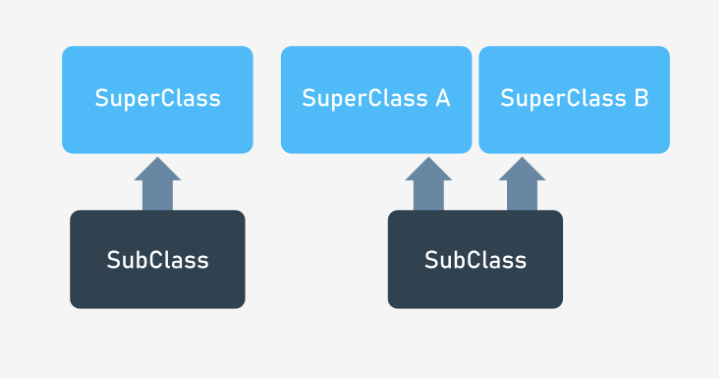

# Contenido
* [Jerarquía de clases](#jerarquía-de-clases)

# Jerarquía de clases
Podemos usar cada clase como una base (o fundación) para definir o construir otra clase (**una sublase**). Además es posible usar **más de una clase para definir una subclase**. Podemos ver ambos casos en la siguiente figura:



Las flechas siempre apuntan a la superclase.

El diagrama de la izquierda ilustra una *"herencia simple"* mientras que el de la derecha una *"herencia múltiple"*.

La siguiente clase:

```cpp
#include <iostream>

using namespace std;

class Super {
private:
    int storage;
public:
    void put(int val)
    { 
        storage = val; 
    }
    int get() 
    { 
        return storage; 
    }
};

int main()
{
    Super object;

    object.put(100);
    object.put(object.get() + 1);
    cout << object.get() << endl;
}
```

nos servirá como **superclase**. El programa arroja la siguiente salida:
```
101
```

Si deseamos definir una clase llamad `Y` como sublase de la clase llamada `X`, usamos la siguiente sintaxis:

```cpp
class Y : visibility_specifier X { ... };
```

La diferencia con la notación que hemos usado antes está en que tenemos:
* Un doble punto luego del number de la subclase
* Un especificador de visibilidad (*opcional*)
* El nombre de la superclase

Si hay más de una superclase debemos enlistarlas usando comas como sseparadores:

```cpp
class A : X, Y, Z { ... };
```

Empezaremos con el casi más simple posible:

```cpp
class Sub : Super {};

int main() {
    Sub object;

    object.put(100);
    object.put(object.get() + 1);
    cout << object.get() << endl;
}
```

Definimos una clase llamada `Sub` que es una subclase de la clase llamada `Super`.

La clase `Sub` no introduce nuevas variables ni funciones. Significa esto que cualquier objeto de la clase `Sub` hereda todos los ragos de la clase `Super`, siendo de hecho una copia de los objetos de la clase `Super`?

No, no significa eso.

Si compilamos el código tendremos errores de compilación diciendo que los métodos `put` y `get` son inaccesibles. Por que?

Cuando omitimos el especificador de visibilidad (`visibility_specifier`) el compilador asume que vamos a aplicar **herencia privada**. Esto significa que todos los componentes públicos de la superclase se vuelven privados, por lo que no son accesibles.

Debemos decirle al compilador que deseamos preservar la politica de acceso previamente usada. Hacemos esto usando la keyword `public`:

```cpp
class Sub : public Super {};
```

De este modo los componentes privados seguirán siendop privados, mientras que los públicos seguirán siendo públicos.

Los objetos de la clase `Sub` pueden hacer casi las mismas cosas que sus pares creados con la clase `Super`. Decimos que "casi" porque ser una subclase también significa que **la clase ha perdido acceso a los componentes privados de la superclase**.

```cpp
class Super {
private:
	int storage;
public:
	void put(int val)
    { 
        storage = val; 
    }
	int get() 
    { 
        return storage; 
    }
};
```

No podemos escribir una función miembro de la clase `Sub` sea capaz de manipular directamentela variable `storage`.

Existe una solución a esto, la cual consiste en utilizar un tercer nivel de acceso no mencionado hasta ahora denominado **`protected`**.

La palabra clave `protected` significa que cualquier componente marcado con ella se comporta como un componente público cuando es usado por cualquier subclase y como privado cuando es usado por el resto del mundo.

Por supuesto, esto es verdadero para las clases heredadas *públicamente*, como la del siguiente snippet:

```cpp
class Sub : public Super { };
```

Finalmente agregamos algunas nuevas funcionalidades a la clase `Sub` y modificamos le acceso a `protected` en el componente storage de `Super`.

```cpp
#include <iostream>

using namespace std;

class Super {
protected:
	int storage;
public:
	void put(int val)
    { 
        storage = val; 
    }
	int get() 
    { 
        return storage; 
    }
};

class Sub : public Super {
public:
	void print() 
    { 
        cout << "storage = " << storage << endl; 
    }
};

int main() 
{
	Sub object;

	object.put(100);
	object.put(object.get() + 1);
	object.print();
}
```

El método `print` accede a la variable `storage` de la superclase, lo cual sería imposible si está fuera declarada `privada`.

En el alcance de la función `main()` esta variable sigue estando oculta, por lo que no podríamos hacer:

```cpp
object.storage = 0;
```
El nuevo programa produce la salida:

```
storage = 101
```

## Resúmen
Sabemos que cualquier componente de la calse puede ser declarado como:
* `public`
* `private`
* `protected`

Estas tres keywords pueden ser usadas en contextos completamente diferentes para especificar la **visibilidad del modelo de herencia**.

Veamos la siguiente tabla

<table>
    <theader>
        <th>
            Cuando el componente es declarado como:
        </th>
        <th>
            Cuando el componente es declarado como:
        </th>
        <th>
            Cuando el componente es declarado como:
        </th>
    </theader>
    <tr>
        <td>
        public
        </td>
        <td rowspan=3>
        public
        </td>
        <td>
        public
        </td>  
    </tr>
    <tr>
        <td>
        protected
        </td>
        <td>
        protected
        </td>  
    </tr>
    <tr>
        <td>
        private
        </td>
        <td>
        none
        </td>  
    </tr>
    <tr>
        <td>
        public
        </td>
        <td rowspan=3>
        protected
        </td>
        <td>
        protected
        </td>  
    </tr>
    <tr>
        <td>
        protected
        </td>
        <td>
        protected
        </td>  
    </tr>
    <tr>
        <td>
        private
        </td>
        <td>
        none
        </td>  
    </tr>
    <tr>
        <td>
        public
        </td>
        <td rowspan=3>
        private
        </td>
        <td>
        private
        </td>  
    </tr>
    <tr>
        <td>
        protected
        </td>
        <td>
        private
        </td>  
    </tr>
    <tr>
        <td>
        private
        </td>
        <td>
        none
        </td>  
    </tr>

</table>

Terminamos el tópico con un ejemplo muy simple de multiherencia. Necesitamos enfatizar que el uso de está técnica es conocida como *una jerarquía de clases propensa a errores y ofuscadora.*

Cualquier solución que evite la multiherencia es generalmente mejor, de hecho muchos lenguajes orientados a objetos actuales no ofrecen multiherencia.

[Ejemplo multiherencia](ejemplos/MultiHierarchy.cpp)

